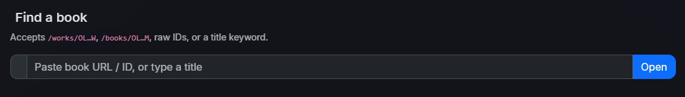
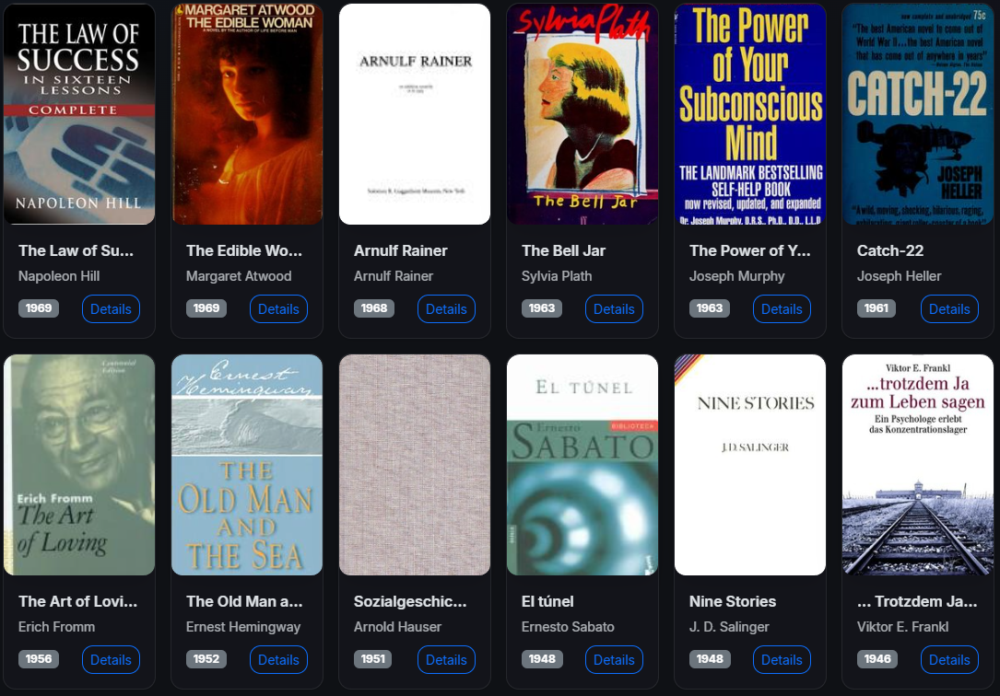

# 📚 Kemal’s OpenLibrary

A modern **Next.js** application for exploring the OpenLibrary API with **photo-driven browsing**, **author & book search**, **dark/light theming**, and **SEO-ready** pages. Built with **React-Bootstrap**, **SWR**, and a clean, accessible UI.

<p align="center">
  <a href="https://kemals-openlibrary.vercel.app" target="_blank"><strong>Live Demo</strong></a> ·
  <a href="#key-features">Features</a> ·
  <a href="#architecture">Architecture</a> ·
  <a href="#setup--local-development">Setup</a> ·
  <a href="#screenshots">Screenshots</a>
</p>

<p align="center">
  
  
  
  
  
</p>

---

## Overview

**Kemal’s OpenLibrary** demonstrates a production-adjacent Next.js app that balances **UX clarity**, **UI polish**, and **solid engineering**:

- **UX clarity:** intuitive navigation, sticky “Back” actions, thoughtful empty/skeleton states.
- **UI polish:** glass surfaces, animated nav underline, theme-aware contrast, consistent spacing.
- **Engineering:** resilient ID/URL parsing, cache-friendly SWR, centralized SEO head, Vercel-ready.

---

## Key Features

- 🔎 **Book Search:** paste a Work/Edition URL/ID (`/works/OL…W` or `/books/OL…M`) or type a title—resolves to the correct Work details.
- 👤 **Author Search:** paste an Author URL/ID (`/authors/OL…A`) or type a name—see profile and works with sorting/pagination.
- 🖼 **Browse (Photo Grid):** random subject covers (fantasy, mystery, etc.) with **Shuffle**, **filter**, and **sort** (Year/Title, Asc/Desc).
- 🌓 **Dark/Light Mode:** remembers preference and respects system settings.
- 🧭 **Sticky Back Buttons:** consistent, always-visible CTAs on long pages.
- ⚡ **SWR Fetching:** client caching, revalidation, and lightweight error handling.
- 🔍 **SEO & Social:** Open Graph + Twitter cards, theme color, and cache-busted favicons.

---

## Screenshots

### Home (Hero)
<p align="center">
  
</p>

### Book Search
<p align="center">
  
</p>

### Author Search
<p align="center">
  
</p>

### Browse (Grid)
<p align="center">
  
</p>

### Author Details
<p align="center">
  
</p>

### Book Details
<p align="center">
  
</p>

---

## Architecture

- **/components**
  - `AuthorDetails.js` – author bio & metadata  
  - `BookDetails.js` – work/book metadata & cover  
  - `Footer.js` – centered attribution & copyright  
  - `MainNav.js` – glass navbar, animated underline, theme toggle  
  - `PageHeader.js` – glass page header with subtitle  
  - `QuickCard.js` – home “quick actions” cards  
  - `SeoHead.js` – SEO + favicons + social tags

- **/pages**
  - `index.js` – hero, quick actions, recently viewed  
  - `about.js` – project context & attributions  
  - `browse.js` – photo grid (random subject), filter & sort  
  - `author-search.js` – URL/ID/name → author profile  
  - `book-search.js` – URL/ID/title → work details  
  - `authors/[authorId].js` – author profile & works (sorted, paginated)  
  - `works/[workId].js` – work/book details + sticky back  
  - `404.js` – not found page  
  - `_app.js` – app wrapper (layout/providers)  
  - `_document.tsx` – HTML shell

- **/public**
  - `favicon.ico`, `favicon.svg` (optional), `apple-touch-icon.png` (optional)  
  - `screenshots/*.png` (used in README)

- **/styles**
  - `globals.css` – theme vars, glass, animated nav underline, tables

---

**Notable choices**
- **Pages Router** for straightforward dynamic routes; zero config on Vercel.  
- **React-Bootstrap** for accessible, responsive primitives with minimal CSS.  
- **Theming** via `data-bs-theme` + CSS variables; hero text/CTAs adapt per theme.  
- **Resilience** in input parsers (IDs/URLs) and graceful “no cover” fallbacks.

---

## Setup & Local Development

**Requirements:** Node 18+, npm 9+

```bash
git clone https://github.com/kemalbatut/Kemal-s-OpenLibrary.git
cd Kemal-s-OpenLibrary
npm install
npm run dev
# open http://localhost:3000
```

---

## Project Scripts
```bash
npm run dev       # Next.js dev server
npm run build     # Production build (used by Vercel)
npm run start     # Serve the production build locally
```

---

## Performance, Accessibility & SEO

- **Performance** — SWR caching; compact global CSS; minimal runtime JS beyond UI needs.
- **Accessibility** — semantic headings, readable focus rings, keyboard-friendly nav, `alt` text, adequate contrast in both themes.
- **SEO** — centralized head: title, meta description, Open Graph (image/url), Twitter large card, theme color, cache-busted favicons.

